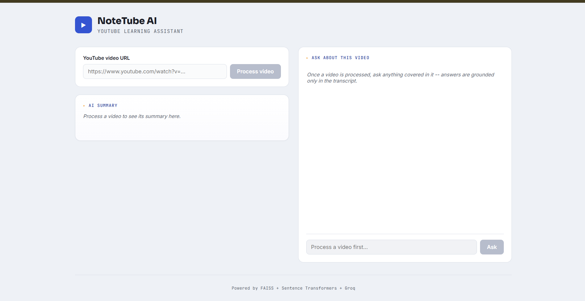
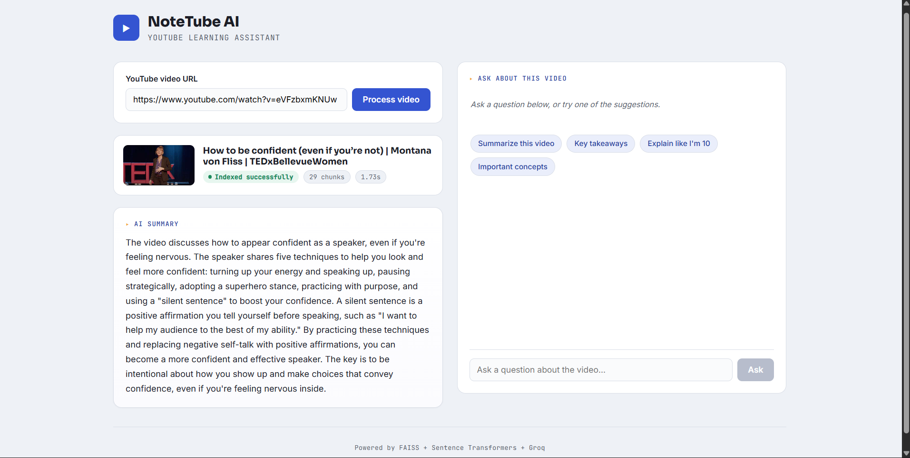
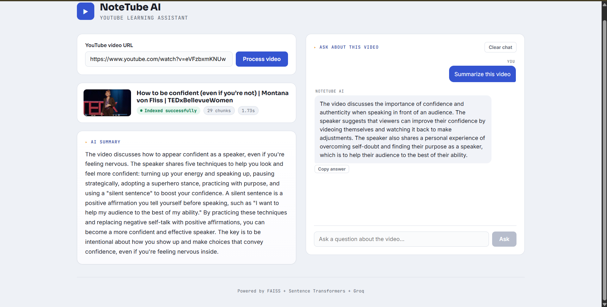
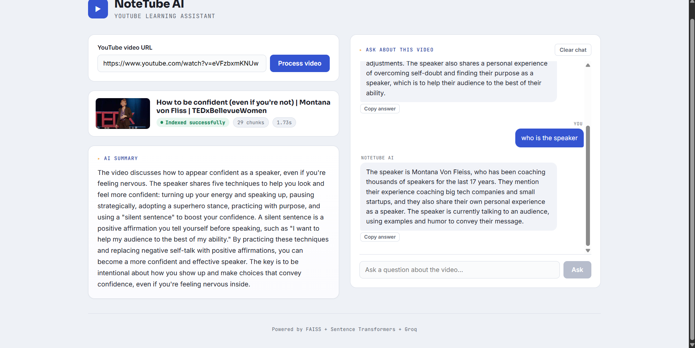

# NoteTube AI – RAG-Based YouTube Learning Assistant

## Overview

Watching long educational YouTube videos to find specific information is time-consuming. Rewatching an entire video just to locate one explanation or concept is inefficient. **NoteTube AI** solves this problem by converting any YouTube video with captions into a searchable knowledge base.

The application extracts the video's transcript, preprocesses and chunks the text, generates semantic embeddings using Sentence Transformers, stores them in a FAISS vector database, and enables users to ask natural-language questions or generate concise AI summaries powered by Retrieval-Augmented Generation (RAG).

This project demonstrates an end-to-end RAG pipeline built with FastAPI, React, FAISS, and Groq's Llama models.

---

## Features

- Process any YouTube video with available captions
- Automatic transcript extraction and preprocessing
- Intelligent transcript chunking
- Semantic search using FAISS vector indexing
- AI-generated summaries
- Retrieval-Augmented Generation (RAG) based question answering
- Context-aware answers grounded only in the video transcript
- Displays video title, thumbnail, processing time, and indexed chunk count
- Clean React chat interface with suggested questions
- Fast REST API built using FastAPI

---

## Tech Stack

### Backend
- Python
- FastAPI
- youtube-transcript-api
- Sentence Transformers
- FAISS
- Groq API (Llama 3.1)

### Frontend
- React
- Vite
- Axios
- CSS

### AI / ML Concepts
- Retrieval-Augmented Generation (RAG)
- Semantic Search
- Sentence Embeddings
- Vector Similarity Search
- Transcript Preprocessing

---

## Architecture

```
                +-------------------+
                |  YouTube Video    |
                +---------+---------+
                          |
                          v
               Transcript Extraction
                          |
                          v
                 Transcript Chunking
                          |
                          v
          Sentence Transformer Embeddings
                          |
                          v
                 FAISS Vector Database
                          |
                          v
             Top-K Semantic Retrieval
                          |
                          v
               Groq Llama 3.1 LLM
                          |
          +---------------+---------------+
          |                               |
          v                               v
   AI Video Summary                RAG-based Answers
```

---

## Workflow

1. User submits a YouTube video URL.
2. The transcript is extracted using **youtube-transcript-api**.
3. The transcript is cleaned and divided into overlapping chunks.
4. Sentence Transformers generate embeddings for every chunk.
5. Embeddings are stored inside a FAISS vector index.
6. For every user question, the most relevant transcript chunks are retrieved.
7. Retrieved context is passed to the Groq LLM to generate accurate, grounded answers.
8. Users can also generate a concise summary of the complete video.

---

## Project Structure

```
notetube-ai/
│
├── backend/
│   ├── app/
│   │   ├── main.py
│   │   ├── config.py
│   │   ├── models/
│   │   │   └── schemas.py
│   │   ├── routes/
│   │   │   ├── video_routes.py
│   │   │   └── chat_routes.py
│   │   ├── services/
│   │   │   ├── transcript_service.py
│   │   │   ├── chunking_service.py
│   │   │   ├── embedding_service.py
│   │   │   ├── vectorstore_service.py
│   │   │   ├── rag_service.py
│   │   │   └── llm_service.py
│   │   └── utils/
│   │       └── youtube_utils.py
│   │
│   ├── faiss_indexes/
│   ├── requirements.txt
│   └── .env.example
│
├── frontend/
│   ├── src/
│   │   ├── components/
│   │   ├── services/
│   │   ├── styles/
│   │   ├── App.jsx
│   │   └── main.jsx
│   ├── package.json
│   └── vite.config.js
│
├── screenshots/
│   ├── home.png
│   ├── video_processed.png
│   ├── summary.png
│   └── question.png
│
├── .gitignore
└── README.md
```

---

## Installation

### 1. Clone the Repository

```bash
git clone https://github.com/your-username/notetube-ai.git

cd notetube-ai
```

---

### 2. Backend Setup

```bash
cd backend

python -m venv venv

# Windows
venv\Scripts\activate

# macOS/Linux
source venv/bin/activate

pip install -r requirements.txt
```

Create a `.env` file inside the backend folder.

Example:

```env
GROQ_API_KEY=your_api_key_here

LLM_MODEL=llama-3.1-8b-instant

EMBEDDING_MODEL=all-MiniLM-L6-v2

CHUNK_SIZE=500

CHUNK_OVERLAP=50

TOP_K_RESULTS=4

FAISS_INDEX_DIR=./faiss_indexes
```

Run the backend:

```bash
uvicorn app.main:app --reload
```

Backend runs on:

```
http://localhost:8000
```

Swagger API Documentation:

```
http://localhost:8000/docs
```

---

### 3. Frontend Setup

```bash
cd frontend

npm install

npm run dev
```

Frontend runs on:

```
http://localhost:5173
```

---

## Environment Variables

| Variable | Description |
|-----------|-------------|
| GROQ_API_KEY | Groq API Key |
| LLM_MODEL | Llama model used for generation |
| EMBEDDING_MODEL | Sentence Transformer model |
| CHUNK_SIZE | Maximum chunk size |
| CHUNK_OVERLAP | Overlap between chunks |
| TOP_K_RESULTS | Number of retrieved chunks |
| FAISS_INDEX_DIR | Directory storing FAISS indexes |

---

## Screenshots

### Home Page

Enter any YouTube video URL to start processing.



---

### Video Successfully Processed

Displays the video thumbnail, title, processing status, chunk count, and processing time.



---

### AI Summary

Generates a concise summary of the processed YouTube video.



---

### Ask Questions About the Video

Ask natural-language questions and receive answers grounded in the video's transcript.



---

## API Endpoints

| Method | Endpoint | Description |
|---------|----------|-------------|
| POST | `/api/video/process` | Process YouTube video |
| POST | `/api/chat/summarize` | Generate AI summary |
| POST | `/api/chat/ask` | Ask questions about the processed video |
| GET | `/` | Health check |

---

## Future Improvements

- Support multilingual transcripts
- Save chat history for each processed video
- Export AI summaries as PDF
- Video bookmarking and notes
- Streaming responses for faster chat experience

---

## Author

**Sejal Rane**

AI/ML • Retrieval-Augmented Generation (RAG) • FastAPI • React • Python

---

## License

This project is developed for educational and portfolio purposes.